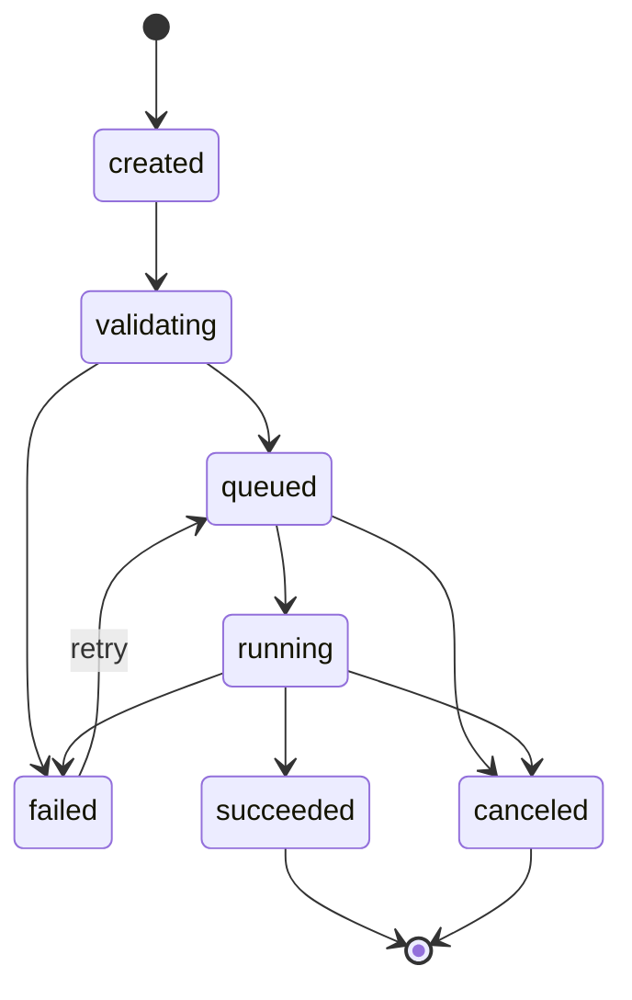

# BetterPPT 技术设计文档（TDD）V1.1

## 1. 文档目标与范围

本文档用于指导 BetterPPT 的后端与前端协作开发，覆盖：

- 系统整体技术架构
- 数据库设计（MySQL + Redis）
- 接口设计（REST API）
- 任务状态机与流转规则

与需求文档保持一致，本版本聚焦 MVP 可交付范围。

## 2. 技术架构设计

## 2.1 架构分层

- `source/frontend`：前端应用，负责文件上传、参数设置、任务进度、结果预览/下载。
- `source/backend`：后端服务，负责鉴权、任务编排、模型调用、状态管理。
- `MySQL`：持久化业务数据（用户、任务、文件、模板分析结果、日志索引）。
- `Redis`：队列、缓存、分布式锁、进度实时状态。
- `Agent Worker`：异步执行流程（校验、解析、RAG、版式匹配、PPT 生成、自检修正）。

## 2.2 逻辑流程

1. 前端上传 PDF 与参考 PPT，创建任务。
2. 后端校验参数并写入 `tasks`，推入 Redis Stream 队列。
3. Worker 消费任务，按状态机执行各阶段步骤。
4. 生成结果文件后回写任务状态与产物地址。
5. 前端轮询或订阅任务状态，成功后预览并下载 PPT。

## 2.3 Agent Worker 技术要求（MVP）

### 2.3.1 执行原则

- 所有核心 Agent 通过统一 LLM API 客户端调用（OpenAI 兼容协议）。
- 统一环境变量：
  - `LLM_API_BASE=https://api.openai.com/v1`
  - `LLM_API_KEY=<secret>`
  - `LLM_MODEL=gpt-4.1-mini`
- 本地模型仅用于辅助能力（视觉 embedding、OCR、轻量分类），不得替代核心推理。

### 2.3.2 Agent 拆分与 I/O 契约

1. `DocumentParseAgent`（step=`parse_pdf`）
   - 输入：PDF 解析文本、结构块、图表候选区域
   - 输出：`sections[]`、`key_facts[]`、`evidence_spans[]`
2. `RagRetrieveAgent`（step=`rag_retrieve`，可选）
   - 输入：`user_prompt`/自动 query、向量检索结果
   - 输出：`retrieved_chunks[]`、`citations[]`、`topic_weights`
3. `OutlinePlanAgent`（step=`plan_slides`）
   - 输入：文档结构、挡位、检索结果
   - 输出：`slide_plan[]`（每页标题、要点、素材引用）
4. `LayoutMapAgent`（step=`analyze_template` + `plan_slides`）
   - 输入：模板 `layout_schema_json`、`slide_plan[]`
   - 输出：`layout_mapping[]`（页面类型、槽位映射、约束）
5. `SlideGenerateAgent`（step=`generate_slides`）
   - 输入：`layout_mapping[]`、素材路径
   - 输出：`edit_ops[]`（增删改指令，供 PPT 编辑器执行）
6. `SelfCorrectAgent`（step=`self_correct`）
   - 输入：生成结果质检信号（溢出/遮挡/错位）
   - 输出：`fix_ops[]`、`quality_report`

### 2.3.3 Worker 产物落库约束

- 每个 step 必须记录 `task_steps.input_json/output_json/duration_ms/error_code`。
- 关键事件（状态切换、重试、降级）必须写入 `task_events`。
- `output_json` 必须是可复现的结构化数据，不允许仅落纯文本。

## 3. 数据库设计

## 3.1 MySQL 设计原则

- 字符集：`utf8mb4`
- 时间字段：统一 `datetime(3)`，默认 UTC 存储
- 主键：`bigint unsigned` 自增（可切换 snowflake）
- 软删除：`is_deleted` + `deleted_at`（用户可见实体优先）
- 幂等：关键写接口使用 `idempotency_key`
- 归属：任务、文件、结果访问均需校验 `user_id`

## 3.2 表结构清单

- `users`：用户主表
- `files`：文件元数据表（原始文件/生成文件）
- `tasks`：任务主表
- `task_steps`：任务步骤执行记录
- `task_events`：任务事件流（前端进度显示）
- `template_profiles`：模板聚类分析汇总
- `template_page_schemas`：模板页面结构化 schema

## 3.3 核心表结构（建议 DDL）

```sql
CREATE TABLE users (
  id BIGINT UNSIGNED PRIMARY KEY AUTO_INCREMENT,
  username VARCHAR(64) NOT NULL,
  email VARCHAR(128) NULL,
  password_hash VARCHAR(255) NULL,
  status TINYINT NOT NULL DEFAULT 1 COMMENT '1=active,0=disabled',
  created_at DATETIME(3) NOT NULL DEFAULT CURRENT_TIMESTAMP(3),
  updated_at DATETIME(3) NOT NULL DEFAULT CURRENT_TIMESTAMP(3) ON UPDATE CURRENT_TIMESTAMP(3),
  UNIQUE KEY uk_users_username (username),
  UNIQUE KEY uk_users_email (email)
) ENGINE=InnoDB DEFAULT CHARSET=utf8mb4;

CREATE TABLE files (
  id BIGINT UNSIGNED PRIMARY KEY AUTO_INCREMENT,
  user_id BIGINT UNSIGNED NOT NULL,
  file_role VARCHAR(32) NOT NULL COMMENT 'pdf_source,ppt_reference,ppt_result,asset_image',
  storage_provider VARCHAR(32) NOT NULL DEFAULT 'local',
  storage_path VARCHAR(512) NOT NULL,
  filename VARCHAR(255) NOT NULL,
  ext VARCHAR(16) NOT NULL,
  mime_type VARCHAR(128) NULL,
  file_size BIGINT UNSIGNED NOT NULL,
  checksum_sha256 CHAR(64) NULL,
  status VARCHAR(32) NOT NULL DEFAULT 'uploaded',
  created_at DATETIME(3) NOT NULL DEFAULT CURRENT_TIMESTAMP(3),
  updated_at DATETIME(3) NOT NULL DEFAULT CURRENT_TIMESTAMP(3) ON UPDATE CURRENT_TIMESTAMP(3),
  KEY idx_files_user_role (user_id, file_role),
  KEY idx_files_checksum (checksum_sha256),
  CONSTRAINT fk_files_user FOREIGN KEY (user_id) REFERENCES users(id)
) ENGINE=InnoDB DEFAULT CHARSET=utf8mb4;

CREATE TABLE tasks (
  id BIGINT UNSIGNED PRIMARY KEY AUTO_INCREMENT,
  user_id BIGINT UNSIGNED NOT NULL,
  task_no VARCHAR(64) NOT NULL,
  source_file_id BIGINT UNSIGNED NOT NULL,
  reference_file_id BIGINT UNSIGNED NOT NULL,
  result_file_id BIGINT UNSIGNED NULL,
  detail_level VARCHAR(16) NOT NULL COMMENT 'concise,balanced,detailed',
  user_prompt TEXT NULL,
  rag_enabled TINYINT NOT NULL DEFAULT 0,
  status VARCHAR(32) NOT NULL COMMENT 'created,validating,queued,running,succeeded,failed,canceled',
  current_step VARCHAR(64) NULL,
  progress INT NOT NULL DEFAULT 0 COMMENT '0-100',
  page_count_estimated INT NULL,
  page_count_final INT NULL,
  error_code VARCHAR(64) NULL,
  error_message VARCHAR(512) NULL,
  retry_count INT NOT NULL DEFAULT 0,
  idempotency_key VARCHAR(128) NULL,
  started_at DATETIME(3) NULL,
  finished_at DATETIME(3) NULL,
  created_at DATETIME(3) NOT NULL DEFAULT CURRENT_TIMESTAMP(3),
  updated_at DATETIME(3) NOT NULL DEFAULT CURRENT_TIMESTAMP(3) ON UPDATE CURRENT_TIMESTAMP(3),
  UNIQUE KEY uk_tasks_task_no (task_no),
  UNIQUE KEY uk_tasks_idempotency (user_id, idempotency_key),
  KEY idx_tasks_user_created (user_id, created_at),
  KEY idx_tasks_status_updated (status, updated_at),
  CONSTRAINT fk_tasks_user FOREIGN KEY (user_id) REFERENCES users(id),
  CONSTRAINT fk_tasks_source_file FOREIGN KEY (source_file_id) REFERENCES files(id),
  CONSTRAINT fk_tasks_reference_file FOREIGN KEY (reference_file_id) REFERENCES files(id),
  CONSTRAINT fk_tasks_result_file FOREIGN KEY (result_file_id) REFERENCES files(id)
) ENGINE=InnoDB DEFAULT CHARSET=utf8mb4;

CREATE TABLE task_steps (
  id BIGINT UNSIGNED PRIMARY KEY AUTO_INCREMENT,
  task_id BIGINT UNSIGNED NOT NULL,
  step_code VARCHAR(64) NOT NULL COMMENT 'validate_input,parse_pdf,analyze_template,rag_retrieve,plan_slides,generate_slides,self_correct,export_ppt',
  step_order INT NOT NULL,
  step_status VARCHAR(32) NOT NULL COMMENT 'pending,running,succeeded,failed,skipped',
  input_json JSON NULL,
  output_json JSON NULL,
  started_at DATETIME(3) NULL,
  finished_at DATETIME(3) NULL,
  duration_ms INT NULL,
  error_code VARCHAR(64) NULL,
  error_message VARCHAR(512) NULL,
  created_at DATETIME(3) NOT NULL DEFAULT CURRENT_TIMESTAMP(3),
  updated_at DATETIME(3) NOT NULL DEFAULT CURRENT_TIMESTAMP(3) ON UPDATE CURRENT_TIMESTAMP(3),
  UNIQUE KEY uk_task_steps_task_order (task_id, step_order),
  KEY idx_task_steps_task_status (task_id, step_status),
  CONSTRAINT fk_task_steps_task FOREIGN KEY (task_id) REFERENCES tasks(id)
) ENGINE=InnoDB DEFAULT CHARSET=utf8mb4;

CREATE TABLE task_events (
  id BIGINT UNSIGNED PRIMARY KEY AUTO_INCREMENT,
  task_id BIGINT UNSIGNED NOT NULL,
  event_type VARCHAR(64) NOT NULL COMMENT 'status_changed,progress_updated,step_log,warning,error',
  event_time DATETIME(3) NOT NULL DEFAULT CURRENT_TIMESTAMP(3),
  message VARCHAR(512) NULL,
  payload_json JSON NULL,
  KEY idx_task_events_task_time (task_id, event_time),
  CONSTRAINT fk_task_events_task FOREIGN KEY (task_id) REFERENCES tasks(id)
) ENGINE=InnoDB DEFAULT CHARSET=utf8mb4;

CREATE TABLE template_profiles (
  id BIGINT UNSIGNED PRIMARY KEY AUTO_INCREMENT,
  file_id BIGINT UNSIGNED NOT NULL,
  profile_version VARCHAR(32) NOT NULL DEFAULT 'v1',
  total_pages INT NOT NULL,
  cluster_count INT NOT NULL,
  embedding_model VARCHAR(64) NOT NULL DEFAULT 'vit-base',
  llm_model VARCHAR(64) NOT NULL DEFAULT 'gpt-4.1-mini',
  summary_json JSON NULL,
  created_at DATETIME(3) NOT NULL DEFAULT CURRENT_TIMESTAMP(3),
  updated_at DATETIME(3) NOT NULL DEFAULT CURRENT_TIMESTAMP(3) ON UPDATE CURRENT_TIMESTAMP(3),
  UNIQUE KEY uk_template_profiles_file_ver (file_id, profile_version),
  CONSTRAINT fk_template_profiles_file FOREIGN KEY (file_id) REFERENCES files(id)
) ENGINE=InnoDB DEFAULT CHARSET=utf8mb4;

CREATE TABLE template_page_schemas (
  id BIGINT UNSIGNED PRIMARY KEY AUTO_INCREMENT,
  template_profile_id BIGINT UNSIGNED NOT NULL,
  page_no INT NOT NULL,
  cluster_label VARCHAR(64) NOT NULL,
  page_function VARCHAR(64) NOT NULL COMMENT 'cover,toc,section,content,comparison,summary,ending',
  layout_schema_json JSON NOT NULL,
  style_tokens_json JSON NULL,
  created_at DATETIME(3) NOT NULL DEFAULT CURRENT_TIMESTAMP(3),
  updated_at DATETIME(3) NOT NULL DEFAULT CURRENT_TIMESTAMP(3) ON UPDATE CURRENT_TIMESTAMP(3),
  UNIQUE KEY uk_tpl_schema_page (template_profile_id, page_no),
  KEY idx_tpl_schema_cluster (template_profile_id, cluster_label),
  CONSTRAINT fk_tpl_page_schema_profile FOREIGN KEY (template_profile_id) REFERENCES template_profiles(id)
) ENGINE=InnoDB DEFAULT CHARSET=utf8mb4;
```

## 3.4 Redis Key 设计（定稿）

- `stream:tasks:pending`（Stream）
  - 待执行任务队列，元素：`task_no`
- `group:tasks:workers`（Consumer Group）
  - Worker 组消费 `stream:tasks:pending`
- `lock:task:{task_no}`（String, EX）
  - 任务级分布式锁，防止重复消费
- `task:progress:{task_no}`（Hash, EX=72h）
  - `status/current_step/progress/message/updated_at`
- `task:events:{task_no}`（List, EX=7d）
  - 最近 500 条事件用于前端快速加载
- `rate_limit:create_task:{user_id}`（String, EX）
  - 任务创建频控

## 4. 接口设计

## 4.1 API 约定

- Base URL：`/api/v1`
- 鉴权：`Authorization: Bearer <token>`（MVP 可先支持测试 token）
- 返回格式统一：

```json
{
  "code": 0,
  "message": "ok",
  "data": {}
}
```

- 错误码约定：`code != 0`
- HTTP 状态码映射建议：
  - `200` 成功
  - `400` 参数错误
  - `401` 未鉴权
  - `403` 无权限
  - `404` 资源不存在
  - `409` 状态冲突/幂等冲突
  - `429` 限流
  - `500` 系统内部错误

## 4.2 接口列表

1. `POST /files/upload-url`
2. `POST /files/complete`
3. `POST /tasks`
4. `GET /tasks/{task_no}`
5. `GET /tasks/{task_no}/events`
6. `POST /tasks/{task_no}/retry`
7. `POST /tasks/{task_no}/cancel`
8. `GET /tasks/{task_no}/preview`
9. `GET /tasks/{task_no}/result`
10. `GET /tasks`

## 4.3 关键接口详细定义

### 4.3.1 获取上传地址

- `POST /api/v1/files/upload-url`

请求体：

```json
{
  "filename": "report.pdf",
  "file_role": "pdf_source",
  "content_type": "application/pdf",
  "file_size": 1024000
}
```

响应体：

```json
{
  "code": 0,
  "message": "ok",
  "data": {
    "file_id": 1001,
    "upload_url": "https://...",
    "headers": {
      "Content-Type": "application/pdf"
    }
  }
}
```

### 4.3.2 上传完成回调

- `POST /api/v1/files/complete`

请求体：

```json
{
  "file_id": 1001,
  "checksum_sha256": "..."
}
```

### 4.3.3 创建任务

- `POST /api/v1/tasks`

请求体：

```json
{
  "source_file_id": 1001,
  "reference_file_id": 1002,
  "detail_level": "balanced",
  "user_prompt": "重点突出市场规模、竞品对比和盈利路径",
  "rag_enabled": true,
  "idempotency_key": "u123-20260402-001"
}
```

参数规则：

- `source_file_id` 必填，且文件角色必须是 `pdf_source`
- `reference_file_id` 必填，且文件角色必须是 `ppt_reference`
- `detail_level` 枚举：`concise|balanced|detailed`
- `user_prompt` 可选，长文档建议填写
- `rag_enabled=true` 且 `user_prompt` 为空时，系统自动构造检索 query

响应体：

```json
{
  "code": 0,
  "message": "ok",
  "data": {
    "task_no": "T202604020001",
    "status": "queued"
  }
}
```

### 4.3.4 查询任务详情

- `GET /api/v1/tasks/{task_no}`

响应体：

```json
{
  "code": 0,
  "message": "ok",
  "data": {
    "task_no": "T202604020001",
    "status": "running",
    "current_step": "generate_slides",
    "progress": 72,
    "detail_level": "balanced",
    "page_count_estimated": 18,
    "page_count_final": null,
    "error_code": null,
    "error_message": null,
    "created_at": "2026-04-02T10:01:02.123Z",
    "updated_at": "2026-04-02T10:03:45.456Z"
  }
}
```

### 4.3.5 查询任务事件流

- `GET /api/v1/tasks/{task_no}/events?cursor=<id>&limit=50`

用途：前端展示进度日志与关键节点。

### 4.3.6 重试任务

- `POST /api/v1/tasks/{task_no}/retry`

规则：

- 仅 `failed` 状态允许重试
- `retry_count` 超过阈值（默认 3）返回错误

### 4.3.7 取消任务

- `POST /api/v1/tasks/{task_no}/cancel`

规则：

- `queued/running` 可取消
- `succeeded/failed/canceled` 不可取消

### 4.3.8 获取在线预览

- `GET /api/v1/tasks/{task_no}/preview`

规则：

- 仅 `succeeded` 状态返回预览数据
- 预览为带时效签名的图片 URL 列表（或后续扩展 HTML 预览）

响应体：

```json
{
  "code": 0,
  "message": "ok",
  "data": {
    "task_no": "T202604020001",
    "slides": [
      {"page_no": 1, "image_url": "https://...", "width": 1920, "height": 1080},
      {"page_no": 2, "image_url": "https://...", "width": 1920, "height": 1080}
    ],
    "expires_in": 3600
  }
}
```

### 4.3.9 下载结果

- `GET /api/v1/tasks/{task_no}/result`

响应体：

```json
{
  "code": 0,
  "message": "ok",
  "data": {
    "file_id": 2001,
    "filename": "result_T202604020001.pptx",
    "download_url": "https://...",
    "expires_in": 3600
  }
}
```

## 4.4 错误码建议

- `1001` 参数非法（不可重试）
- `1002` 文件不存在或无权限（不可重试）
- `1003` 文件类型不支持（不可重试）
- `1004` 任务状态不允许该操作（不可重试）
- `1005` 幂等冲突（可引导前端读取已有任务）
- `2001` 任务执行失败（可重试）
- `2002` 模板解析失败（可重试）
- `2003` 生成失败（可重试）
- `3001` 系统繁忙（建议退避重试）
- `9000` 系统内部错误（可重试）

## 5. 任务状态机

## 5.1 状态定义

- `created`：任务已创建，待校验
- `validating`：参数与文件校验中（内部步骤：`validate_input`）
- `queued`：已入队等待 Worker
- `running`：执行中（细分步骤见下）
- `succeeded`：任务成功
- `failed`：任务失败
- `canceled`：任务取消

`running` 阶段内部步骤（`current_step`）：

1. `parse_pdf`
2. `analyze_template`
3. `rag_retrieve`（可选）
4. `plan_slides`
5. `generate_slides`
6. `self_correct`
7. `export_ppt`

## 5.2 状态转移规则

- `created -> validating -> queued -> running -> succeeded`
- 校验失败：`validating -> failed`
- 任意执行阶段出现不可恢复错误：`running -> failed`
- 用户主动取消：`queued/running -> canceled`
- 重试：`failed -> queued`

状态机图：



## 5.3 进度映射建议

- `validate_input`：0-5（`validating`）
- `parse_pdf`：6-20
- `analyze_template`：21-40
- `rag_retrieve`：41-50
- `plan_slides`：51-65
- `generate_slides`：66-88
- `self_correct`：89-96
- `export_ppt`：97-100

## 6. Worker 执行与幂等设计

### 6.1 LLM 调用策略

- 默认模型：`LLM_MODEL=gpt-4.1-mini`。
- 调用协议：OpenAI 兼容 HTTP API（`{LLM_API_BASE}`）。
- 超时与重试：
  - 单次请求超时建议 45s
  - 可重试错误最多 2 次（指数退避：1s、2s）
- 限流与退避：命中 `429` 时按 `Retry-After` 或指数退避重试。
- 降级策略：
  - LLM 连续失败超过阈值时，任务标记 `failed` 并返回可读错误码
  - 非核心步骤（如可选 RAG）可降级为跳过并记录事件

### 6.2 Worker 幂等与断点续跑

- Worker 消费前先获取 `lock:task:{task_no}`，避免并发重复执行。
- 每步执行前检查 `task_steps` 是否已成功，已成功则跳过（断点续跑）。
- 导出结果成功后，需事务内原子更新：
  - `tasks.status = succeeded`
  - `tasks.result_file_id = <file_id>`
  - `tasks.finished_at`
- `idempotency_key` 命中时返回已存在 `task_no`，HTTP `409`，业务码 `1005`。

## 7. 安全与合规

- 上传文件白名单校验（扩展名 + MIME 双重校验）。
- 上传完成后执行恶意文件扫描，未通过则阻断任务创建。
- 文件下载 URL 使用短时效签名。
- 对外接口保留审计日志（操作人、时间、IP、task_no）。
- 默认数据留存（可配置）：源文件 7 天、结果文件 30 天、审计日志 180 天。

## 8. 开发落地建议

## 8.1 目录建议

- `source/backend/app/api`：接口层
- `source/backend/app/services`：业务服务层
- `source/backend/app/workers`：异步任务执行层
- `source/backend/app/models`：ORM 模型
- `source/backend/migrations`：数据库迁移
- `source/frontend/src/pages`：页面
- `source/frontend/src/services`：接口调用封装

## 8.2 MVP 实施顺序

1. 完成文件上传与任务创建链路
2. 完成 `tasks/task_steps/task_events` 表与基础 Worker
3. 接入模板分析与生成流程（可先 mock 模型）
4. 完成前端进度页、在线预览与结果下载
5. 加入重试、取消、限流、观测与审计能力

---

如与实现阶段存在冲突，以可运行、可观测、可回溯为优先，随后迭代模型质量与版式精度。

